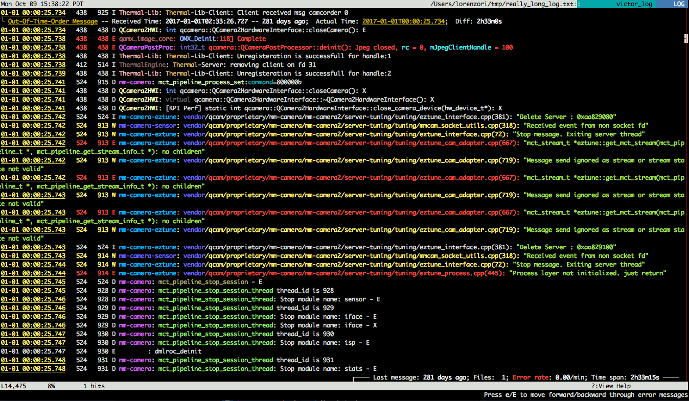

# lnav-configuration
Configuration files and commands to have lnav parse Victor logs

# Introduction
[lnav\(http://lnav.org/) is a powerful generic log viewer. It supports syntax highlighting, searching using regular expressions, filtering and SQL queries. This package adds syntax highlighting for the log files Victor produces. The [documentation](http://lnav.readthedocs.io/en/latest/) is well written and all the commands are properly documented.

# Usage

1. Install [lnav](http://lnav.org/downloads/): `brew install lnav`
2. Copy all the files in a subfolder of ~/.lnav/formats
   
   Example: `~/.lnav/formats/victor`
3. Launch `adb logcat | lnav`
4. Enjoy the colors!  

# Common scripts
There's some useful scripts in the repository already, and more will come. Feel free to add yours or open an issue for suggestions. To run a script use the `|` command. 

Remember: auto-completion with `TAB` is your friend! 

# Contributing
Feel free to add PRs or make suggestions/requests via the issues tracker or the development branch

# Notes
* The filters are not stacked. If you run `filter-A` and then `filter-B`, it is possible that `filter-B` will override (part of) `filter-A`.
* Most of the regular expressions are generated using [regex101](https://regex101.com/). 

